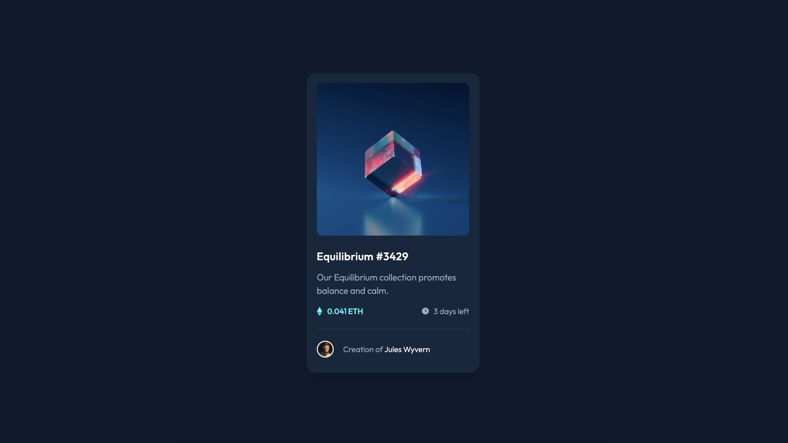

# Frontend Mentor - NFT Preview Card Component

This is a solution to the <a href="https://www.frontendmentor.io/challenges/nft-preview-card-component-SbdUL_w0U">"NFT Preview Card Component"</a> on Frontend Mentor.
<br>
Frontend Mentor challenges help ypu improve your coding skills by building realistic projects.

# 📖 Table of contents

- [Brief](#📋-brief);
- [Screenshot](#🖥-screenshot);
- [Technologies](#🔧-technologies);
- [Code](#💾-code);
- [Author](#🧔-author);

# 📋 Brief

Build out a NFT preview card component and get it looking as close to the design as possible.
<br>
Use any tools to help the completion of the challenge.
<br>
Users should be able to:
<br>

- View the optimal layout depending on their device's screen size;

# 🖥 Screenshot



# 🔧 Technologies


# 💾 Code

```html
<body>
	<!-- // main container ===== start -->
	<div class="container-fluid">
		<!-- // card container ===== start -->
		<div class="card-container">
			<!-- // top row ===== start -->
			<div class="top-row">
				
				<div class="nft-overlay"></div>
				
			</div>
			<!-- // top row ===== end -->
			<!-- // bottom row ===== start -->
			<div class="bottom-row">
				<!-- // title and description ===== start -->
				<div class="title-description">
					<a href="#" class="title-active"
						><h1 id="title">Equilibrium #3429</h1></a
					>
					<p id="description">
						Our Equilibrium collection promotes balance and calm.
					</p>
				</div>
				<!-- // title and description ===== end -->
				<!-- // price and time ===== start -->
				<div class="price-time">
					<div class="price">
						<i class="fa-brands fa-ethereum"></i>
						<p id="price-text">0.041 ETH</p>
					</div>
					<div class="time">
						<i class="fa-solid fa-clock"></i>
						<p id="time-text">3 days left</p>
					</div>
				</div>
				<!-- // price and time ===== end -->
				<!-- // author ===== start -->
				<div class="author">
					
					<p id="author-credits">
						Creation of <a href="#" class="author-link">Jules Wyvern</a>
					</p>
				</div>
				<!-- // author ===== end -->
			</div>
			<!-- // bottom row ===== end -->
		</div>
		<!-- // card container ===== end -->
	</div>
	<!-- // main container ===== end -->
	<!-- // bootstrap js ===== start // -->
	<script
		src="https://cdn.jsdelivr.net/npm/bootstrap@5.2.0-beta1/dist/js/bootstrap.bundle.min.js"
		integrity="sha384-pprn3073KE6tl6bjs2QrFaJGz5/SUsLqktiwsUTF55Jfv3qYSDhgCecCxMW52nD2"
		crossorigin="anonymous"
	></script>
	<!-- // bootstrap js ===== end // -->
</body>
```

```css
/* fonts */

@import url('https://fonts.googleapis.com/css2?family=Outfit:wght@300;400;500;600&display=swap');

/* color palette */

:root {
	--color-cyan: #00fdfb;
	--color-light-100: #ffffff;
	--color-light-200: #9bb2d1;
	--color-dark-100: #2f4159;
	--color-dark-200: #15273f;
	--color-dark-300: #0d1a2d;
	--color-dark-400: #0c1729;
}

/* default reset */

* {
	margin: 0;
	padding: 0;
	box-sizing: border-box;
}

body {
	font-family: 'Outfit', sans-serif;
	background-color: var(--color-dark-300);
	overflow: hidden;
}

p {
	font-weight: 300;
	font-size: 18px;
}

a {
	text-decoration: none;
}

/* main container */

.container-fluid {
	width: 100%;
	min-height: 100vh;
	position: relative;
	display: flex;
	align-items: center;
	justify-content: center;
	padding: 2rem;
	background: var(--color-light-gray);
	overflow: hidden;
}

/* card container */

.card-container {
	width: 100%;
	max-width: 350px;
	border-radius: 20px;
	background: var(--color-dark-200);
	box-shadow: 0 1rem 1.5rem var(--color-dark-400);
	overflow: hidden;
}

.top-row {
	display: grid;
	grid-template-rows: 1fr;
	grid-template-columns: 1fr;
	border-radius: 10px;
	padding: 1.3rem;
}

.bottom-row {
	padding: 0.5rem 1.3rem;
}

/* information */

#title {
	font-weight: 500;
	font-size: 22px;
	letter-spacing: 0.5px;
	color: var(--color-light-100);
}

#title:hover {
	color: var(--color-cyan);
	cursor: pointer;
}

#description {
	margin-top: 1rem;
	font-weight: 300;
	color: var(--color-light-200);
}

/* price and time */

.price-time {
	display: flex;
	align-items: center;
	justify-content: space-between;
}

.price {
	display: flex;
	align-items: center;
	color: var(--color-cyan);
}

#price-text {
	margin-left: 0.6rem;
	font-weight: 500;
	font-size: 16px;
}

.fa-ethereum {
	padding-bottom: 15px;
	font-size: 18px;
}

.time {
	display: flex;
	align-items: center;
	color: var(--color-light-200);
}

#time-text {
	margin-left: 0.6rem;
	font-weight: 300;
	font-size: 16px;
}

.fa-clock {
	padding-bottom: 15px;
	font-size: 14px;
}

/* author */

.author {
	padding: 0.8rem 0;
	margin-top: 0.5rem;
	display: flex;
	align-items: center;
	border-top: 1px solid var(--color-dark-100);
}

.author img {
	margin-right: 1.2rem;
	width: 11%;
	background: red;
	border: 2px solid var(--color-light-100);
	border-radius: 50px;
}

#author-credits {
	padding-top: 15px;
	font-weight: 300;
	font-size: 16px;
	color: var(--color-light-200);
}

.author-link {
	color: var(--color-light-100);
	cursor: pointer;
}

.author-link:hover {
	color: var(--color-cyan);
}

/* image overlay on hover */

.nft {
	width: 100%;
	grid-column: 1;
	grid-row: 1;
	border-radius: 10px;
	cursor: pointer;
}

.nft-overlay {
	display: none;
	grid-column: 1;
	grid-row: 1;
	grid-template-columns: 1fr;
	grid-template-rows: 1fr;
	border-radius: 10px;
	background: var(--color-cyan);
	opacity: 0.5;
}

.nft:hover ~ .nft-overlay {
	display: block;
}

.nft:hover ~ .img-view {
	display: block;
}

.img-view {
	display: none;
	place-self: center;
	grid-column: 1;
	grid-row: 1;
	background-color: transparent;
	z-index: 1;
}

/* media query */

@media (max-width: 375px) {
	#description {
		font-size: 16px;
	}
}
```

# 🧔 Author

- <a href="https://github.com/ynncstslv" target="_blank">GitHub</a>;
- <a href="https://linkedin.com/in/ynncstslv" target="_blank">LinkedIn</a>;
- <a href="https://codepen.io/ynncstslv" target="_blank">Codepen</a>;
- <a href="https://instagram.com/ynncstslv" target="_blank">Instagram</a>;
- <a href="https://twitter.com/ynncstslv" target="_blank">Twitter</a>;
